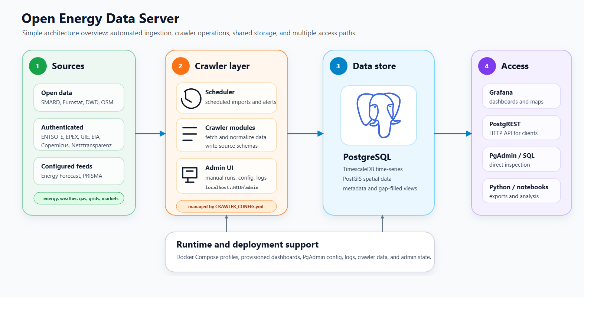

<!-- SPDX-FileCopyrightText: Florian Maurer, Christian Rieke, Andre Meyer, Haoshen Zhang, Johannes Schuhmacher -->
<!-- SPDX-License-Identifier: AGPL-3.0-or-later -->

# Open Energy Data Server

This repository builds on the original
[Open Energy Data Server](https://github.com/NOWUM/open-energy-data-server)
and extends it for the workflows documented here.

Open Energy Data Server (OEDS) is a crawler-driven data platform for
energy-system analysis. It combines data ingestion, PostgreSQL/TimescaleDB,
PostgREST, and Grafana into one reusable stack for collecting, storing, and
serving energy data.

Interactive documentation is available on
[Read the Docs](https://open-energy-data-server-kit.readthedocs.io/en/latest/).



## What OEDS includes

- crawler modules for public and semi-public energy datasets
- PostgreSQL with TimescaleDB for time-series storage
- PostGIS for spatial extensions
- PostgREST for HTTP access to database objects
- provisioned Grafana dashboards

## Repository layout

The root directory intentionally keeps only the operator entry points and the
files that Docker Compose or contributors need immediately:

- `compose.yml`: the local and server Compose stack entry point
- `CRAWLER_CONFIG.yml`: the versioned default crawler configuration
- `crawler_scheduler.py` and `crawler_admin_server.py`: runtime entry points
- `docker/`: container build files and database bootstrap assets
- `crawler/`, `crawler_admin/`: source-specific crawlers and the admin UI
- `crawler_core/`, `oeds_gapfill/`: stable import surfaces for shared runtime
  and gapfill logic
- `playbooks/`: reproducible host install, update, backup, and smoke-test
  playbooks
- `docs/`: Sphinx source and operator/developer documentation

Some top-level files stay on purpose because moving them deeper into the tree
would make Compose, documentation, and operator workflows harder to follow.

Typical source areas already covered in the repository include:

- ENTSO-E Transparency Platform File Library
- weather forecasts via Open-Meteo DWD
- SMARD
- Eurostat
- Energy Forecast price forecasts

## Source access model

OEDS combines sources with different access and licensing models:

- open public sources such as SMARD, Eurostat, or weather APIs
- credentialed or semi-public sources such as ENTSO-E FMS
- proprietary APIs such as `energyforecast.de`

That means a successful deployment depends not only on OEDS itself, but also on
your rights to access, store, and republish the upstream data. Always review
source-specific terms, rate limits, and license conditions before enabling a
crawler in a public environment.

## Quick start

Start the local services from the repository root:

```bash
docker compose up -d
```

> Warning
> The public Compose defaults intentionally use insecure credentials such as
> `opendata/opendata`, `readonly/readonly`, and `admin/admin`. This quick-start
> path is only suitable for isolated local, internal, or disposable test
> systems. Do not expose a host that still uses these defaults on a shared or
> public network.

If you already have a populated PostgreSQL/TimescaleDB data directory from an
older major version, do not switch the image tags in place. Moving to
PostgreSQL 18 requires a database migration such as `pg_upgrade` or
dump/restore.

This starts the standard local development stack:

- PostgreSQL / TimescaleDB on `localhost:6432`
- PgAdmin on `http://localhost:8080/`
- PostgREST on `http://localhost:3001/`
- Grafana on `http://localhost:3006/`

If one of these ports is already occupied, override it with an environment
variable such as `OEDS_POSTGRES_PORT=16432`.

If you want different passwords even in the public Compose path, set the
relevant environment variables before the first startup, for example
`OEDS_DB_PASSWORD`, `OEDS_READONLY_PASSWORD`,
`OEDS_GRAFANA_ADMIN_PASSWORD`, and `OEDS_PGADMIN_DEFAULT_PASSWORD`.

Optional crawler services are available through the `crawlers` profile:

```bash
docker compose --profile crawlers up -d scheduler crawler-admin
```

This builds a shared Python image and starts:

- the scheduler as `python crawler_scheduler.py`
- the admin UI as `python crawler_admin_server.py`

Additional crawler-service access:

- Crawler Admin UI on `http://localhost:3010/admin`

Portainer is no longer part of the default core stack. If you want the optional
container-management UI, start the `ops` profile explicitly:

```bash
docker compose --profile ops up -d portainer portainer_agent
```

The Portainer documentation requires the first admin setup to finish within a
few minutes after the first startup. If you do not need a separate container UI,
the Docker CLI remains the primary operations path for OEDS.

The crawler containers keep these runtime paths writable and persistent across
restarts:

- `CRAWLER_CONFIG.yml`
- `crawler/.env` as a Compose `env_file`
- `crawler/data/`
- `logs/`

The admin UI also persists its run history and log metadata in
`crawler_admin_state/`. In the container profile it has write access to the
mounted `CRAWLER_CONFIG.yml` so scheduler edits and YAML saves survive
rebuilds.

For host deployments you can point these runtime paths at a separate directory
by setting `OEDS_RUNTIME_DIR` before running Compose.

For a reproducible host install through Ansible, the public defaults already
point to the GitHub `main` branch:

```bash
cd playbooks
cp inventory.example.yml inventory.yml
ansible-playbook -i inventory.yml oeds-install-crawlers.yml
```

The example inventory is prefilled for a same-host Linux install with `sudo`.
For a remote host, replace the `localhost` entry with `ansible_host` and, when
needed, `ansible_user`. The full deployment workflow is documented in
[`playbooks/README.md`](playbooks/README.md).

Sync the Python environment:

```bash
uv sync --locked
```

For host-side crawler execution, this environment includes native dependencies
such as `pygrib` and therefore expects an available `ecCodes` toolchain. On
Windows, Docker or WSL is usually the simpler path.

For crawler-specific credentials, create `crawler/.env` from
`crawler/.env.example`.

Run a crawler manually:

```bash
uv run python -m crawler.weather_forecast
uv run python -m crawler.entsoe_fms
uv run python -m crawler.energy_forecast_crawler
```

Run the scheduler:

```bash
uv run python crawler_scheduler.py
```

Run the admin UI:

```bash
uv run python crawler_admin_server.py
```

`uv` creates the local `.venv/`, respects `.python-version`, and both entry
points still load `crawler/.env` automatically when the file exists.

## Configuration

The scheduler and helper scripts read crawler settings from `CRAWLER_CONFIG.yml`.
Important settings include:

- `enable`
- `schedule`
- `schema_name`
- `database_uri`
- crawler-specific options such as `forecast_hours` or `target_data_items`

Credentials and local operator overrides should not be committed. Keep them in
`crawler/.env` or another local environment mechanism.

Credentialed crawlers such as `entsoe_fms`, `energy_forecast_crawler`, and
`epex_spot` should be reviewed before the first scheduler run. On a fresh
deployment, set the required secrets and, for `entsoe_fms`, adjust
`default_start_date` if you do not want a full historical backfill.

On a clean installation, crawler-backed schemas and dashboards remain empty
until the first successful crawler run. For example, the `weather` schema and
its dashboard panels are created and populated only after the first
`weather_forecast` execution.

For local alert routing, `crawler/.env` can override the committed default email
recipients with `OEDS_EMAIL_TOADDRS`. That lets you test dashboard mail alerts
or scheduler error notifications without changing `CRAWLER_CONFIG.yml`.

If you run the scheduler or admin UI inside Docker, the containers override the
database host and port at runtime so that the existing local-style
`localhost:6432` URIs can still target `open-data:5432` on the internal Docker
network. That keeps the same `CRAWLER_CONFIG.yml` usable for both host and
container-based runs.

On deployment hosts, `OEDS_RUNTIME_DIR` can be used to move mutable runtime
files such as `CRAWLER_CONFIG.yml`, `crawler/.env`, `logs/`, and
`crawler_admin_state/` outside the Git checkout.

For public releases, treat deployment credentials, source API tokens, and local
operator notes as environment-specific material rather than repository content.

## Notable dashboards

Provisioned dashboards live under `data/provisioning/grafana/dashboards/` and
are grouped into crawler-specific subfolders plus `shared/`.
Examples include:

- `Weather Dashboard`
- `Energy Weather Dashboard`
- `ENTSOE Stress Cockpit`
- `ENTSOE Cross-Border & Price Spread Cockpit`
- `ENTSOE Negative Prices - Event 2026-04-26`
- `ENTSOE Negative Prices - Long-Term Analysis`
- `ENTSOE Transfer Capacity, Adequacy & Projects`

These dashboards depend on their related crawler schemas being populated.

## Documentation

For local and published documentation, start here:

- [Getting Started](docs/source/getting_started.md)
- [Deployment Guide](docs/source/deployment.md)
- [Crawler Documentation](docs/source/crawlers/README.md)
- [Crawler Configuration](docs/source/crawler_config.md)
- [Crawler Development](docs/source/crawler_development.md)
- [Crawler Admin UI](docs/source/crawler_admin.md)
- [Deployment Validation](docs/source/deployment_validation.md)
- [Examples](docs/source/examples/index.rst)
- [Open-Source Roadmap](docs/source/open_source_maturity.md)
- [Ansible Playbooks](playbooks/README.md)

## Contributing

Contribution guidelines live in [CONTRIBUTING.md](CONTRIBUTING.md).

For a first contribution, the recommended local loop is:

```bash
uv sync --locked
uv tool run pre-commit install
uv run --with pytest python -m pytest tests
uv run --only-group docs sphinx-build -b dummy docs/source docs/_build/dummy
```

Current maintained lint scope:

```bash
uv run --only-group dev ruff check crawler_admin/gapfill_service.py crawler_admin/runtime_service.py crawler_admin_server.py crawler_core crawler_scheduler.py oeds_gapfill scripts/gapfill_timeseries.py scripts/refresh_entsoe_availability_map.py tests/test_gapfill_config.py tests/test_gapfiller_core.py tests/test_public_facades.py tests/test_runtime_env.py
uv run --only-group dev ruff format --check crawler_admin/gapfill_service.py crawler_admin/runtime_service.py crawler_admin_server.py crawler_core crawler_scheduler.py oeds_gapfill scripts/gapfill_timeseries.py scripts/refresh_entsoe_availability_map.py tests/test_gapfill_config.py tests/test_gapfiller_core.py tests/test_public_facades.py tests/test_runtime_env.py
uv tool run pre-commit run --all-files
```

This scoped lint list is the current "lint baseline": these files must stay
clean under `ruff` on every pull request, while older untouched areas are
cleaned up incrementally instead of blocking every change at once.

If you want a guided path through the stack before changing code, start with:

- [Local stack to first query](docs/source/examples/local_stack_first_query.md)
- [First crawler change](docs/source/examples/first_crawler_change.md)
- [Gapfill QA walkthrough](docs/source/examples/gapfill_qa_walkthrough.md)

When adding a crawler or a new derived dataset:

1. add or update the crawler module under `crawler/`
2. register its scheduler entry in `CRAWLER_CONFIG.yml`
3. document it under `docs/source/crawlers/`
4. document authentication, source license, and downstream dependencies
5. add bootstrap SQL to `docker/initdb/10-init.sql` if fresh installs need it
6. run the relevant checks before opening a change

## License

This repository is a KIT-maintained derivative of the Open Energy Data Server
project. It keeps the upstream lineage transparent through the Git history,
SPDX metadata, and the upstream link above while removing legacy assets that are
not part of the maintained KIT deployment path.

This project is licensed under `AGPL-3.0-or-later`. See
[`LICENSES/AGPL-3.0-or-later.txt`](LICENSES/AGPL-3.0-or-later.txt).
