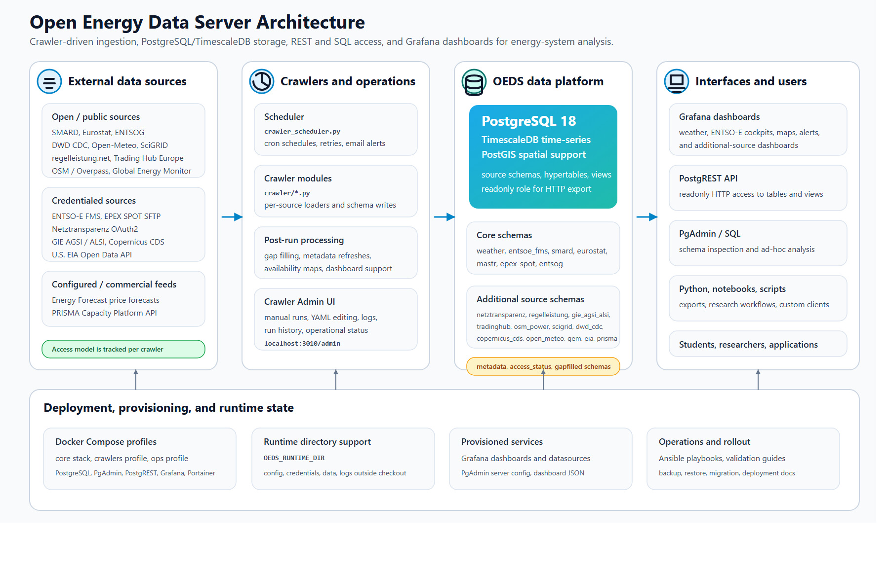
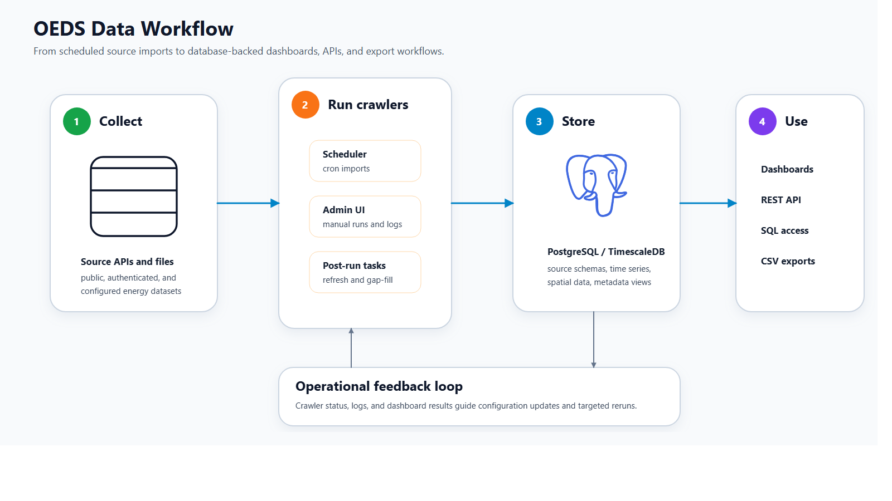

Welcome to the OEDS documentation
=================================

Open Energy Data Server (OEDS) combines crawlers, PostgreSQL/TimescaleDB,
PostgREST, and Grafana into one reusable data platform for energy-system
analysis.

.. toctree::
   :maxdepth: 1
   :caption: Overview

   README
   getting_started
   deployment
   deployment_validation
   crawler_admin
   crawler_config
   post_run_scripts
   price_forecasting
   open_source_maturity
   troubleshooting
   crawler_development

.. toctree::
   :maxdepth: 1
   :caption: Crawler Documentation

   crawlers/README
   crawlers/entsoe_fms
   crawlers/entsog
   crawlers/entsoe_api
   crawlers/weather_forecast
   crawlers/energy_forecast_crawler
   crawlers/smard
   crawlers/mastr
   crawlers/eurostat_crawler
   crawlers/epex_spot

.. toctree::
   :maxdepth: 1
   :caption: Guides and Examples

   minimal_walkthrough/index
   examples/index
   backup_restore_migration/index

Architecture
------------

.. image:: media/oeds-architecture.png
   :alt: OEDS architecture overview

Detailed Architecture
---------------------

Workflow
--------

The documentation is organized so that new users can start with the overview
and getting-started guides, while operators and developers can jump directly to
the crawler-specific pages and example sections.
