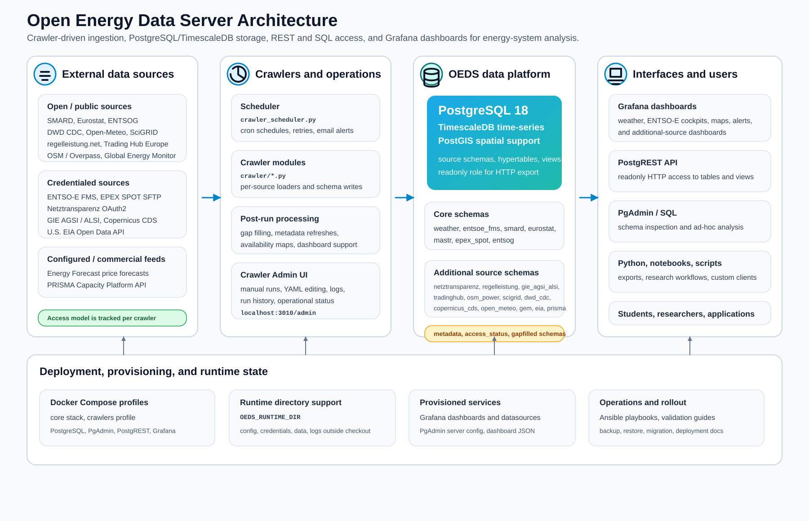

Open Energy Data Server (KIT)
=============================

Open Energy Data Server (KIT), or OEDS-KIT, combines crawlers,
PostgreSQL/TimescaleDB, PostgREST, and Grafana into one reusable data platform
for energy-system analysis.

Start here
----------

Choose the shortest entry path for your goal:

- New to the project and want a local stack:
  `Getting Started <getting_started.html>`_
- Installing OEDS on a clean server:
  `Installation <installation.html>`_
- Deploying a long-lived server or VM:
  `Deployment Guide <deployment.html>`_
- Operating schedulers, manual runs, and gapfill:
  `Crawler Admin UI <crawler_admin.html>`_
- Looking for a specific data source:
  `Crawler Documentation <crawlers/README.html>`_

.. toctree::
   :maxdepth: 1
   :caption: Overview

   README
   installation
   getting_started
   deployment
   crawler_admin
   crawler_config
   post_run_scripts
   price_forecasting
   backup_restore_migration/index
   open_source_maturity
   troubleshooting
   crawler_development

.. toctree::
   :maxdepth: 1
   :caption: Crawler Documentation

   crawlers/README
   crawlers/entsoe_fms
   crawlers/entsoe_api
   crawlers/entsog
   crawlers/weather_forecast
   crawlers/energy_forecast_crawler
   crawlers/smard
   crawlers/mastr
   crawlers/eurostat_crawler
   crawlers/epex_spot
   crawlers/additional_energy_sources

.. toctree::
   :maxdepth: 1
   :caption: Guides and Examples

   examples/index
   examples/application_examples
   examples/client_export_examples
   examples/http_export_examples
   minimal_walkthrough/index

Architecture
------------

.. image:: media/oeds-architecture.png
   :alt: OEDS architecture overview

Detailed Architecture
---------------------

Workflow
--------

.. image:: media/oeds-workflow.png
   :alt: OEDS workflow overview

The documentation is organized so that new users can start with the overview
and getting-started guides, while operators and developers can jump directly to
deployment, crawler operations, troubleshooting, and crawler-specific pages.
